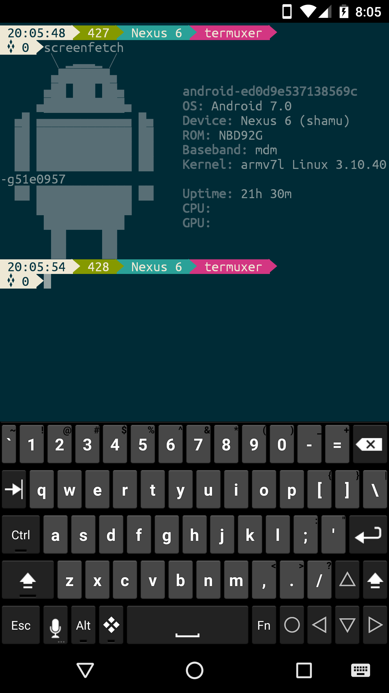

# termuxer

**termuxer** is a simple yet fancy Oh-My-Zsh theme inspired by agnoster and linuxer theme. It features:

- Current Line of Command
- Current Device Display
- Current Directory status
- Last Returned Error Code

## Installation

**wget should be installed**

type the following in the terminal:

`wget -p https://raw.githubusercontent.com/patrick330602/termux/master/termuxer.zsh-theme -O ~/.oh-my-zsh/themes/termuxer.zsh-theme`

## License

The Project is under MIT.
